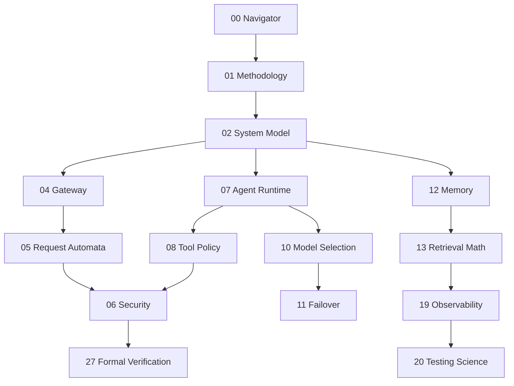

# 00 - Navigator

## Reading Strategy

### Path A (Architecture & Formalism)

1. `01_methodology-and-evidence.md`
2. `02_system-model-and-formal-assumptions.md`
3. `04_gateway-composition-root-deconstruction.md`
4. `05_gateway-request-automata-and-scope-logic.md`
5. `06_security-boundary-and-threat-model.md`
6. `27_formal-verification-roadmap.md`

7. `30_call-flow-catalog-by-file-function.md`

### Path B (Agent Runtime Engineering)

1. `03_bootstrap-runtime-contracts.md`
2. `07_agent-runtime-state-machine.md`
3. `08_tool-policy-lattice-and-resolution.md`
4. `09_sandbox-capability-calculus.md`
5. `14_session-routing-algebra.md`
6. `23_ai-agent-engineer-playbook-phd.md`

### Path C (LLM Systems)

1. `10_model-selection-normalization-theory.md`
2. `11_failover-cooldown-and-stochastic-resilience.md`
3. `12_memory-ingestion-indexing-dynamics.md`
4. `13_hybrid-retrieval-ranking-mathematics.md`
5. `24_llm-engineer-playbook-phd.md`

### Path D (Data Science & Evaluation)

1. `13_hybrid-retrieval-ranking-mathematics.md`
2. `19_observability-and-identifiability.md`
3. `20_testing-science-and-metamorphic-strategies.md`
4. `25_data-scientist-playbook-phd.md`
5. `28_research-agenda-and-open-problems.md`

## Dependency Graph

