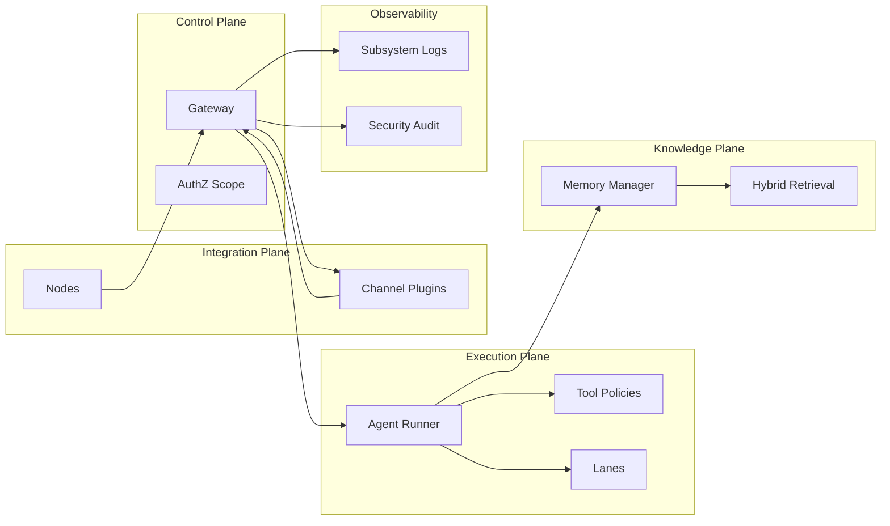

# 02 - System Model And Formal Assumptions

## Abstract system model

OpenClaw được mô hình hóa như 5-plane system:

- Control Plane: gateway RPC/HTTP + governance
- Execution Plane: agent runtime + tools + queue
- Knowledge Plane: memory indexing/retrieval
- Integration Plane: channels/plugins/nodes
- Observability Plane: logs/metrics/audit/events

## State variables (conceptual)

Ký hiệu:

- `C`: config state
- `S`: session store
- `Q`: command queues by lanes
- `P`: plugin registry
- `M`: memory indices
- `A`: auth profile store
- `N`: node registry

Hệ thống runtime tại thời điểm `t` là:

`X_t = (C_t, S_t, Q_t, P_t, M_t, A_t, N_t)`

## Transition classes

- `tau_cfg`: config mutation transitions
- `tau_req`: gateway request-triggered transitions
- `tau_evt`: background event transitions (cron/heartbeat/channel)
- `tau_fail`: error/fallback transitions

## Safety properties (high-level)

- SP1: unauthorized method invocation must be rejected
- SP2: denied tool must not execute
- SP3: lane clearing must not resurrect stale active tasks
- SP4: session route isolation must preserve agent boundaries

## Liveness properties (high-level)

- LP1: queued task eventually executes or fails explicitly
- LP2: approval request eventually resolves or expires
- LP3: fallback chain eventually returns output or typed failure

## System decomposition diagram

