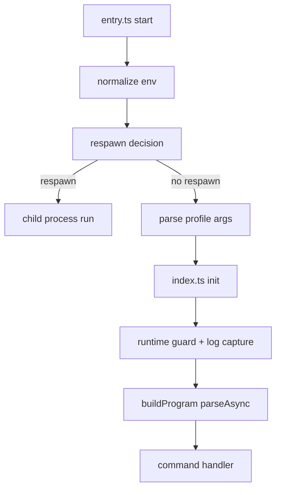

# 03 - Bootstrap Runtime Contracts

## Contract C1 - Environment normalization precedes dispatch

`src/entry.ts` và `src/index.ts` đảm bảo env normalization chạy trước command parsing.

Implication: tránh divergence giữa CLI paths do env state không chuẩn hóa.

## Contract C2 - Warning suppression bounded respawn

Respawn mechanism có guard variables để tránh infinite spawn.

Failure obligation: phải chứng minh guard không bị bypass bởi argument mutation.

## Contract C3 - Runtime guard fail-fast

`assertSupportedRuntime()` gây fail-fast nếu runtime không hợp lệ.

Property: ưu tiên deterministic failure hơn undefined behavior.

## Contract C4 - Terminal restoration on exit

`defaultRuntime.exit` restore terminal state trước `process.exit`.

Property: operational UX safety và tránh side-effect cho phiên shell kế tiếp.

## Bootstrap control-flow

