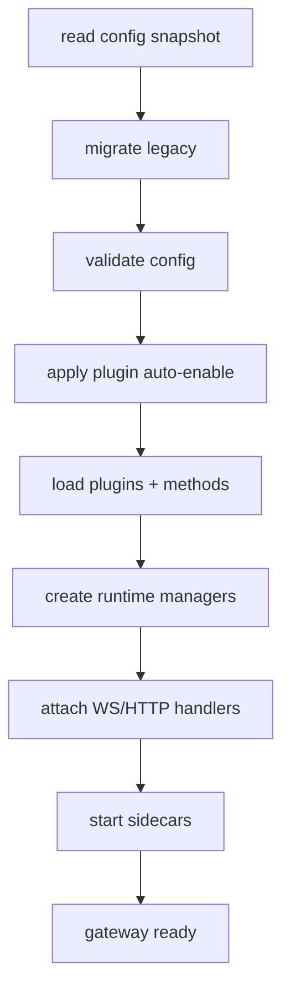

# 04 - Gateway Composition Root Deconstruction

## Why composition root matters

`startGatewayServer()` là điểm duy nhất mà hầu hết subsystem dependencies được wire together. Đây là nơi tốt nhất để định nghĩa global invariants.

## Phases of composition

### Phase 1 - Config truth establishment

- read snapshot
- legacy migration
- validation
- plugin auto-enable pass

### Phase 2 - Runtime scaffolding

- init diagnostics/restart policy
- resolve default agent/workspace
- load plugin registry and channel methods

### Phase 3 - Service graph activation

- create channel manager/node registry/approval managers
- attach ws/http handlers
- start sidecars (cron/discovery/tailscale/etc)

## Coupling hotspots

- config <-> plugin loader
- gateway methods <-> plugin methods
- channel managers <-> agent routing/session stores

## Critical invariants

- I1: gateway methods list must include plugin channel extensions without shadowing core handlers
- I2: invalid config must fail before network exposure
- I3: restart deferral must account for active queue and active runs

## Composition flow

