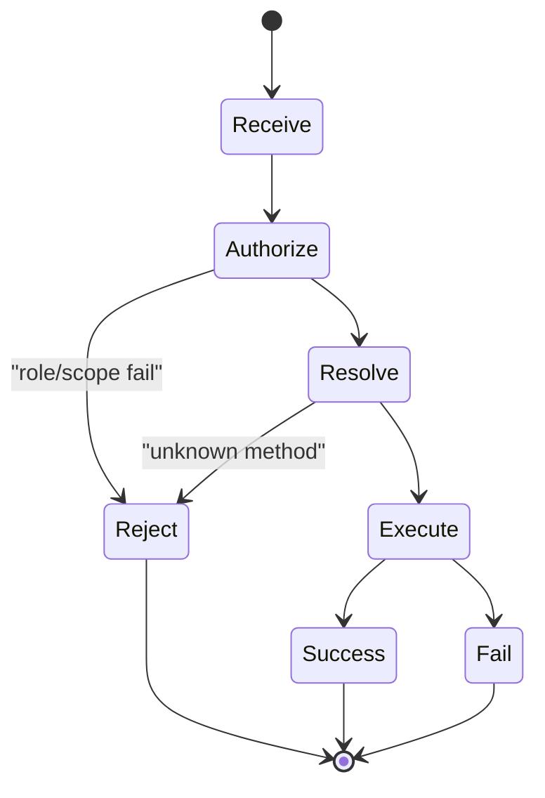

# 05 - Gateway Request Automata And Scope Logic

## Request automaton

Mỗi request đi qua deterministic automaton:

1. authorize(role, scope, method)
2. resolve handler
3. execute handler
4. emit response/error

## Scope lattice

Logical scopes:

- `operator.read`
- `operator.write`
- `operator.admin`
- `operator.approvals`
- `operator.pairing`

`operator.admin` behaves as top privilege for operator role.

## Role restriction theorem (practical)

Node-role client chỉ được phép gọi node-specific methods đã allowlisted. Mọi method khác phải reject.

## Failure classes

- F1: unknown method
- F2: unauthorized role
- F3: missing scope
- F4: handler runtime error

## Automaton diagram

