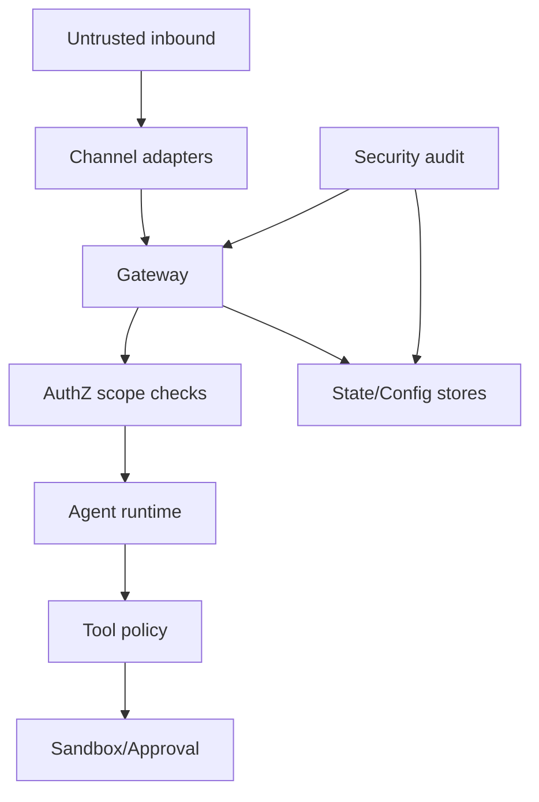

# 06 - Security Boundary And Threat Model

## Trust zones

- TZ0: local trusted operator context
- TZ1: gateway-authenticated clients (scoped)
- TZ2: external channels/inbound messages (untrusted)
- TZ3: plugin code and third-party dependencies (semi-trusted)

## Threat categories

- unauthorized control-plane access
- privilege escalation through tools
- config/state file tampering
- prompt/data injection via channels/memory
- plugin supply-chain risks

## Security controls map

### Gateway controls

- auth mode
- bind policy
- method scopes
- rate limiting

### Execution controls

- tool policy pipeline
- sandbox policy
- exec approvals

### Persistence controls

- filesystem permissions audit
- config secrets hygiene checks

### Integration controls

- channel DM policy/pairing
- allowlists

## Threat model diagram

## Proof obligations

- PO1: no request bypasses scope guard
- PO2: denied tool path is total (no side path execution)
- PO3: risky filesystem permissions are detectable and actionable
