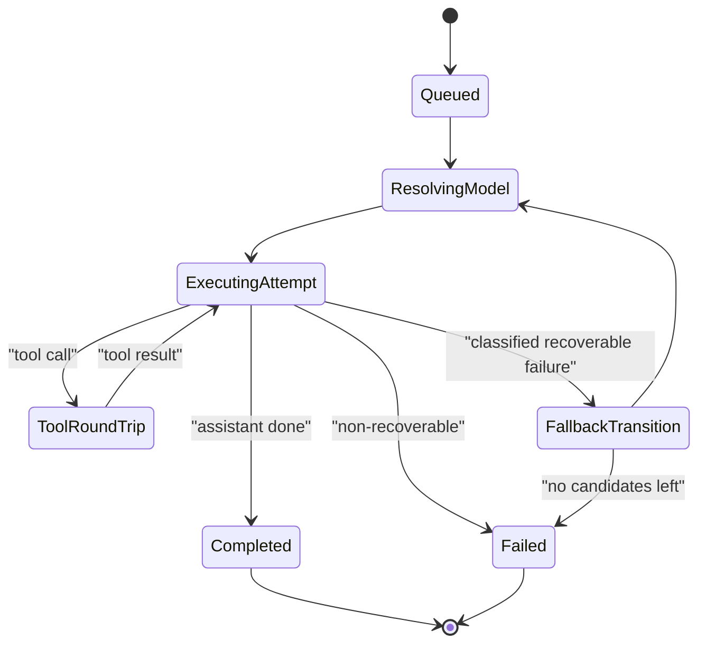

# 07 - Agent Runtime State Machine

## Core machine

Agent run represented as finite-state machine:

- `Queued`
- `ResolvingModel`
- `ExecutingAttempt`
- `ToolRoundTrip`
- `FallbackTransition`
- `Completed`
- `Failed`

## Transition triggers

- lane dequeue
- hook overrides
- model/auth resolve results
- tool execution callbacks
- failover classifications
- abort/timeout signals

## State machine

## Invariants

- IR1: each run binds to one session lane and one global lane context
- IR2: usage accounting cannot double-count cache context as total prompt window
- IR3: hook override cannot violate provider/model normalization constraints

## Hot paths by file

- `src/agents/pi-embedded-runner/run.ts`
- `src/agents/pi-embedded-runner/run/attempt.ts`
- `src/agents/model-fallback.ts`
- `src/process/command-queue.ts`
