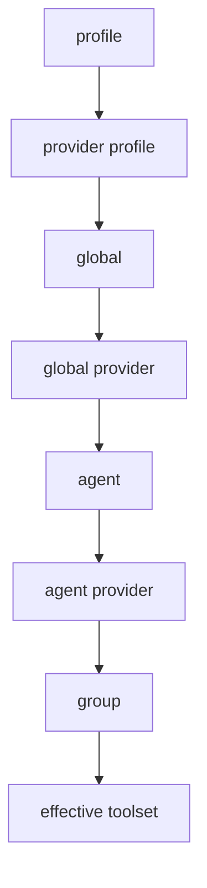

# 08 - Tool Policy Lattice And Resolution

## Policy lattice view

Policy layers tạo một lattice theo specificity:

`profile < provider-profile < global < global-provider < agent < agent-provider < group`

Effective toolset là giao của các constraints sau expansion/normalization.

## Resolution algorithm (conceptual)

1. Build base tool list.
2. Build plugin tool groups.
3. For each policy step:
   - normalize and strip invalid plugin-only allowlists when required
   - expand plugin groups
   - filter tools by policy
4. Return final tool list.

## Algebraic properties

- Monotonicity: thêm deny không thể tăng toolset
- Non-monotonic risk: allowlist with unknown plugin alias có thể gây accidental collapse nếu không strip
- Idempotence: re-applying same policy step yields same result

## Lattice diagram

## Verification targets

- VT1: no tool outside declared registry appears in effective set
- VT2: deny precedence is preserved after plugin group expansion
- VT3: sandbox policy overlays preserve explicit denies
