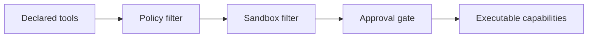

# 09 - Sandbox Capability Calculus

## Capability model

Xem mỗi tool là capability token `cap_i`.

Effective capability set:

`Cap_eff = (Cap_declared ∩ Cap_policy) ∩ Cap_sandbox ∩ Cap_approval_runtime`

Trong đó:

- `Cap_policy`: kết quả policy lattice
- `Cap_sandbox`: giới hạn từ sandbox config
- `Cap_approval_runtime`: các capability cần runtime approval

## Runtime approval semantics

Approval introduces temporal gate:

- capability usable iff approval state is `allow-*` and not expired

## Safety theorem (practical)

Nếu `cap_exec ∉ Cap_eff` thì không có đường đi hợp lệ đến command execution handler.

## Diagram

## Engineering implications

- Approval UX latency ảnh hưởng liveness, không ảnh hưởng safety nếu gate đúng.
- Misconfigured `alsoAllow` cần được theo dõi để tránh mở capability quá rộng.
