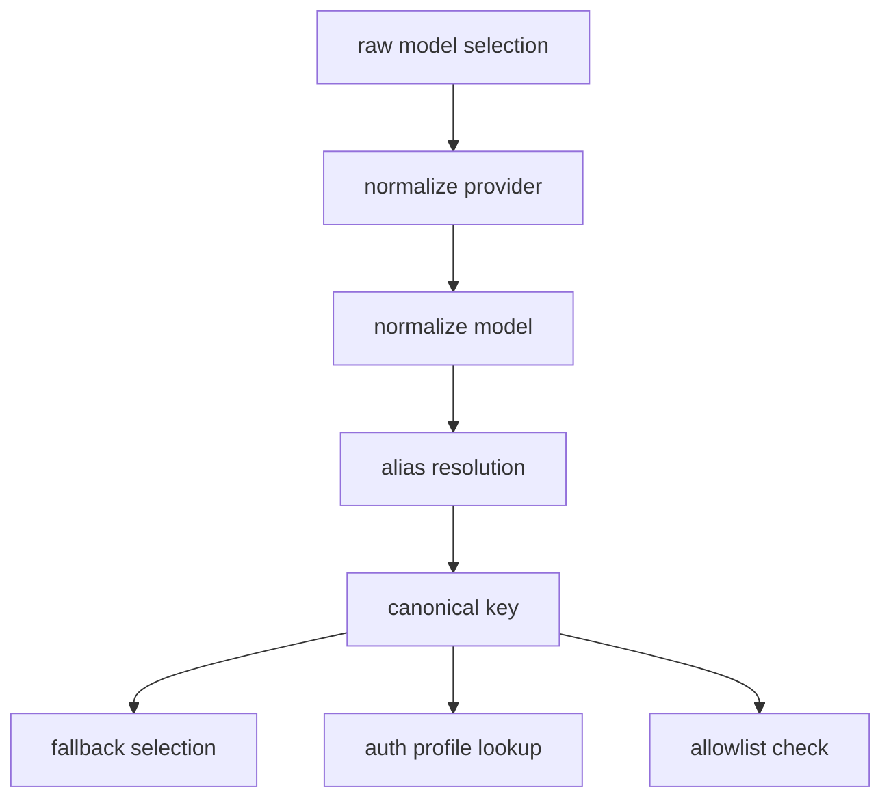

# 10 - Model Selection Normalization Theory

## Problem

Provider/model identifiers đến từ nhiều nguồn:

- user input
- alias names
- legacy config
- provider-specific naming conventions

Nếu không normalize thống nhất, hệ thống sẽ gặp:

- allowlist mismatch
- cache key fragmentation
- fallback inconsistency

## Normalization pipeline

1. normalize provider id
2. normalize provider-specific model id
3. resolve alias (if any)
4. emit canonical `(provider, model)` pair

## Canonical key

`k = provider + "/" + model`

Các subsystems downstream dùng `k` cho:

- allowlist membership
- fallback dedupe
- alias reverse lookup

## OpenAI-codex redirect heuristic

Một số model prefix được map sang provider logic `openai-codex` thay vì `openai`.

Đây là compatibility layer để ghép auth/runtime behavior đúng theo backend.

## Diagram

