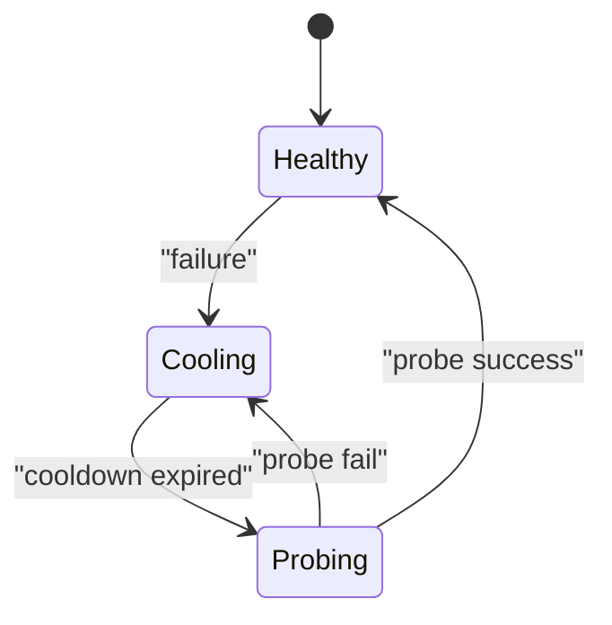

# 11 - Failover Cooldown And Stochastic Resilience

## Failover as stochastic process

Mỗi attempt tương ứng Bernoulli outcome conditioned on provider/profile state.

Nếu candidate list là `c1..cn`, expected success latency phụ thuộc:

- per-candidate success probability
- per-candidate latency distribution
- cooldown dynamics (availability over time)

## Cooldown mechanism role

Cooldown giảm retry oscillation với bad profiles, tương tự circuit-breaker half-open strategy.

## Probe throttling

Primary reprobe bị throttle để tránh burst probes trong interval ngắn.

## Failure taxonomy value

Phân loại lý do lỗi (auth, billing, timeout, overflow, rate-limit) cho phép:

- chọn candidate strategy tốt hơn
- cảnh báo upstream credential issues
- tối ưu expected utility thay vì blind retry

## Markov-style abstraction

## Research direction

Xây adaptive failover policy bằng Bayesian update trên success likelihood theo channel/workload class.
