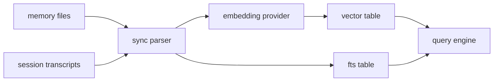

# 12 - Memory Ingestion Indexing Dynamics

## Manager lifecycle

`MemoryIndexManager` duy trì lifecycle dài hạn:

- init DB and schema
- resolve embedding provider
- maintain file watchers/session listeners
- sync and index asynchronously

## Sources and freshness

Nguồn dữ liệu:

- memory markdown corpus
- session transcript deltas
- optional extra memory paths

Freshness được điều tiết bằng dirty flags + scheduled sync triggers.

## Consistency model

Mô hình consistency thực tế là eventual consistency có bounded lag theo sync settings.

## Failure handling

- provider unavailable -> degrade to FTS-only
- vector extension load error -> fallback behavior + warning
- sync errors -> logged, không crash toàn runtime

## Pipeline diagram

