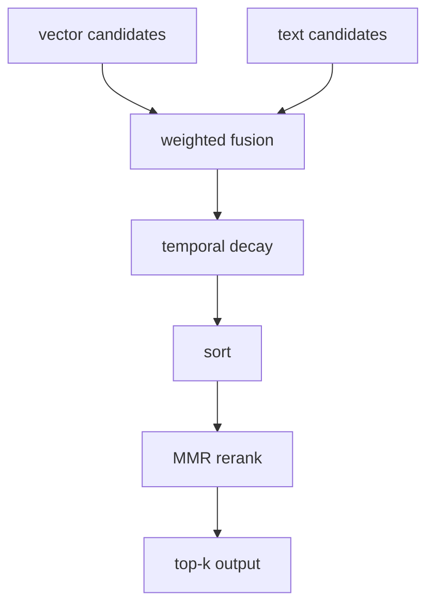

# 13 - Hybrid Retrieval Ranking Mathematics

## Baseline fusion

Hybrid score:

`score = w_v * score_vector + w_t * score_text`

với `w_v, w_t >= 0`.

## BM25 rank mapping

Hệ dùng `1/(1+rank)` cho text score normalization.

Ưu điểm: đơn giản và bounded.
Hạn chế: mất shape information của raw BM25 values.

## Temporal decay

Dùng exponential decay với half-life `h`:

`decay(age) = exp(-ln(2)*age/h)`

Final score sau decay:

`score' = score * decay(age)`

## MMR reranking

MMR objective:

`MMR = lambda * relevance - (1-lambda) * max_similarity_to_selected`

Similarity hiện tại dùng Jaccard token similarity trên snippet text.

## Ranking pipeline order

1. fusion
2. temporal decay (optional)
3. sort
4. mmr rerank (optional)

## Diagram

