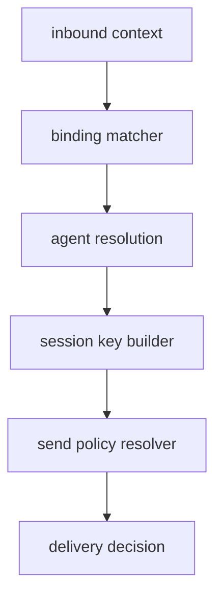

# 14 - Session Routing Algebra

## Routing function

Xem routing như hàm:

`R: InputContext -> (agentId, sessionKey, matchedBy)`

`InputContext` gồm:

- channel
- accountId
- peer/parentPeer
- guild/team
- role metadata

## Match precedence

Precedence chain đảm bảo deterministic choice khi nhiều rule có thể match.

## Algebraic properties

- Determinism: cùng input + cùng config -> cùng output
- Stability under irrelevant fields: field không dùng trong rule không được đổi output
- Prefix compatibility: raw/normalized session key prefixes hỗ trợ migration-safe matching

## Send policy operator

`P_send(session, channel, chatType, key) -> {allow, deny}`

composition:

- session override > rules > default

## Diagram

## Verification ideas

- property-based tests cho determinism
- mutation tests cho precedence robustness
- conformance tests giữa legacy and normalized key paths
