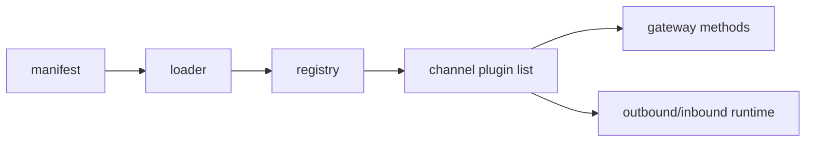

# 15 - Channel Plugin Contract Semantics

## Contract layers

### L1 - Discovery and loading

Plugin phải được discoverable và manifest-valid.

### L2 - Registration

Plugin phải đăng ký channel/tool/hook/method qua plugin API.

### L3 - Runtime behavior

Channel adapters phải thỏa semantics outbound/inbound/auth/threading.

## Contract risk classes

- schema mismatch
- runtime missing adapter
- plugin method collision
- partial registration state

## Semantics of channel list

`listChannelPlugins()` đảm bảo:

- dedupe by id
- stable ordering
- runtime registry as source of truth

## Conformance test blueprint

- plugin loads with minimal config
- plugin method surface is unique and callable
- channel status and send path behave under invalid input

## Diagram

