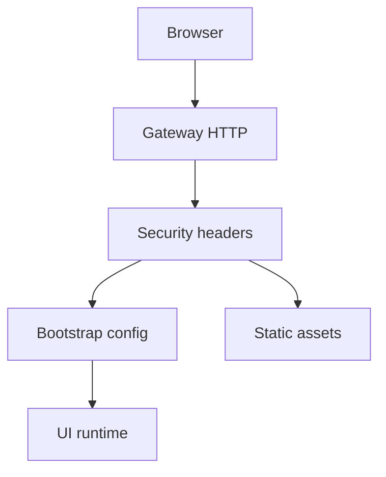

# 17 - Control UI Surface And CSP Analysis

## Surface definition

Control UI được serve từ gateway, nên UI requests chia sẻ trust boundary với control plane.

## Security controls at edge

`control-ui.ts` áp dụng:

- CSP
- frame deny
- nosniff
- referrer policy

## Bootstrap and identity channel

UI bootstrap endpoint cung cấp assistant identity/avatar metadata. Đây là data plane cần sanitize and auth consistency.

## Path safety

Static file serving có safe-relative-path guards để giảm traversal risk.

## Diagram

## Open questions

- mức đủ của CSP hiện tại cho plugin-injected UI features?
- cần signed bootstrap payload cho remote hostile network scenarios không?
