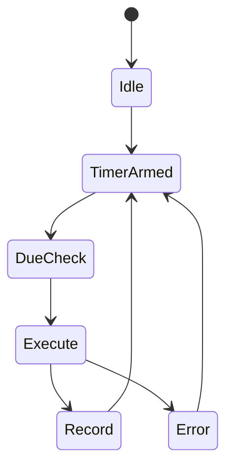

# 18 - Cron Temporal Semantics And Isolation

## Temporal semantics

Cron job execution phụ thuộc:

- schedule parse
- due computation
- timer management
- catch-up behavior on restart

## Isolation model

Isolated-agent cron path giảm interference với interactive sessions.

## Safety-liveness trade-off

- safety: tránh duplicate run / conflicting session writes
- liveness: không bỏ lỡ jobs khi restart hoặc under load

## Critical invariants

- CI1: one-shot jobs disable đúng sau completion
- CI2: duplicate timers không cùng trigger một job id
- CI3: forced run không phá trạng thái due scheduling

## Diagram

