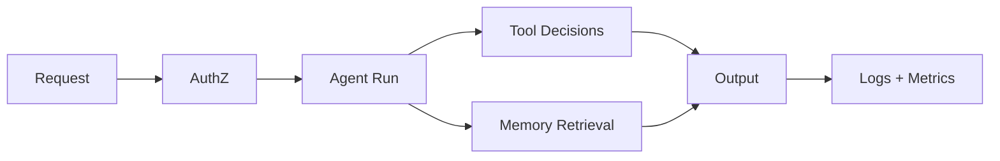

# 19 - Observability And Identifiability

## Observability goal

Không chỉ log nhiều; mục tiêu là identifiable system dynamics:

- biết tại sao một output xảy ra
- biết bottleneck nằm ở đâu
- biết policy nào chặn hành vi

## Signal classes

- S1: request/method lifecycle
- S2: agent run and fallback traces
- S3: queue wait/active metrics
- S4: tool policy decision traces
- S5: security audit findings

## Identifiability gaps

Current gaps thường gặp:

- thiếu unified correlation id cross subsystem
- thiếu policy explain payload cho denied tool
- thiếu retrieval mode marker trong outputs

## Proposed telemetry schema

- `trace_id`, `run_id`, `session_key`, `agent_id`
- `method`, `scope_decision`, `tool_decision`
- `fallback_reason`, `retrieval_mode`, `queue_wait_ms`

## Causal chain diagram

