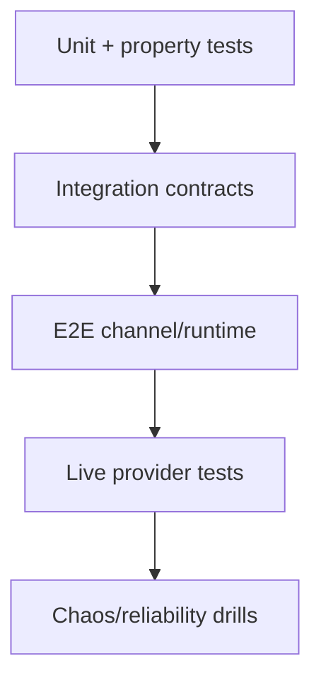

# 20 - Testing Science And Metamorphic Strategies

## Beyond unit tests

Với hệ agent phức hợp, cần kết hợp:

- contract tests
- metamorphic tests
- property-based tests
- scenario stress tests

## Metamorphic relation examples

- MR1: thêm stop-words vào query không làm thay đổi top-1 retrieval relevance đáng kể
- MR2: reorder equivalent policy clauses không đổi effective toolset
- MR3: rename alias model về canonical id không đổi chosen provider-model pair

## Property-based testing targets

- routing determinism
- policy monotonicity with deny additions
- queue safety under lane reset

## Counterfactual test strategy

Sinh synthetic failures (auth timeout, provider 429, plugin load failure) để đo resilience policies.

## Test pyramid for OpenClaw-like systems

