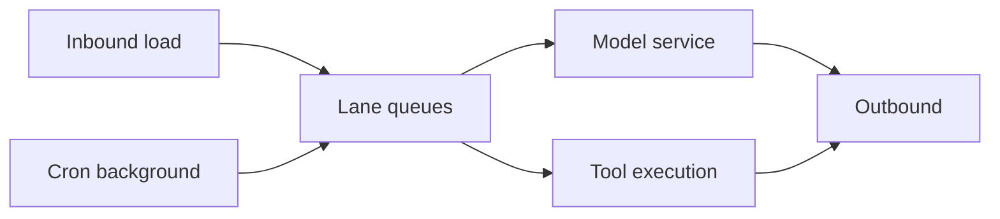

# 26 - Performance Bottlenecks And Scaling Model

## Bottleneck classes

- queue serialization bottlenecks
- provider latency bottlenecks
- memory sync/index bottlenecks
- channel integration bottlenecks

## Queue-centric scaling model

Approximate response latency:

`L_total = L_queue + L_model + L_tool + L_delivery`

Trong nhiều workload interactive, `L_queue` có thể trở thành dominant term nếu lane concurrency chưa hợp lý.

## Capacity planning variables

- arrivals per lane
- service time distribution per task class
- fallback-induced retries
- cron background load

## Practical scaling levers

- lane concurrency tuning
- tool timeout rationalization
- memory sync cadence tuning
- selective isolation for noisy channels/plugins

## Diagram

