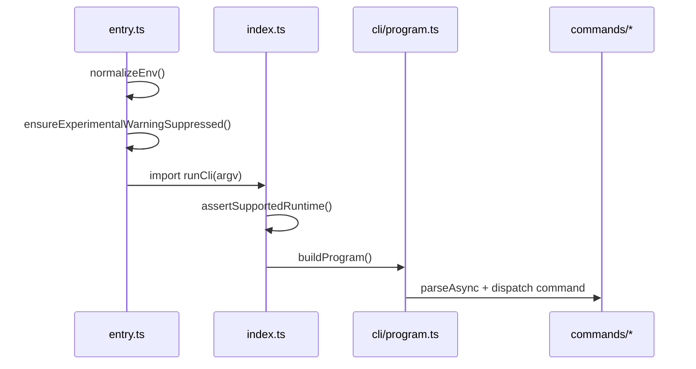
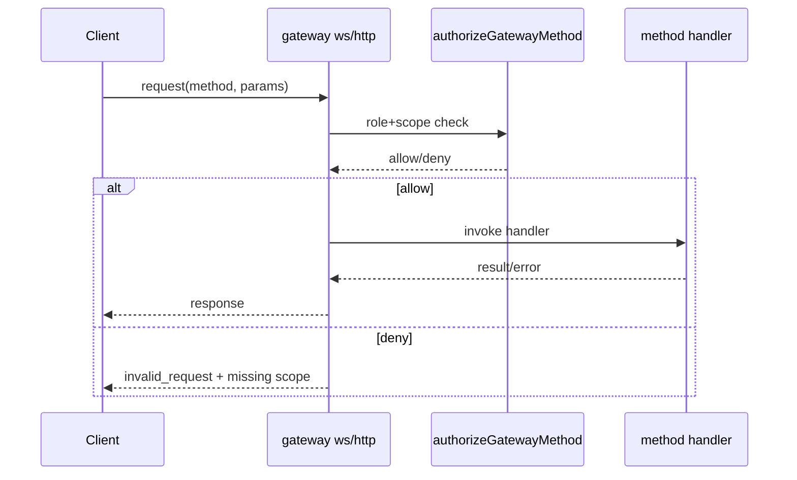
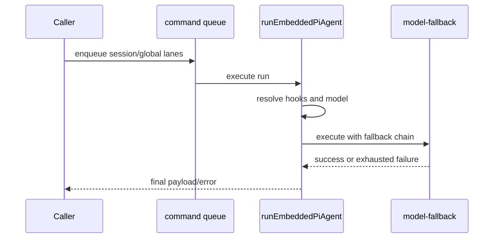

# 30 - Call Flow Catalog By File Function

## CF-1 CLI bootstrap to command execution

- `src/entry.ts`: env normalization + respawn policy + profile arg parsing
- `src/index.ts`: runtime guard + `buildProgram()`
- `src/cli/program.ts`: command routing
- `src/commands/*`: concrete command handlers

## CF-2 Gateway request lifecycle

- `src/gateway/server.impl.ts`: runtime composition
- `src/gateway/server-methods.ts`: authorization + handler dispatch
- `src/gateway/server-methods/*`: method implementations

## CF-3 Agent run with fallback

- `src/agents/pi-embedded-runner/run.ts`: run orchestrator
- `src/agents/model-fallback.ts`: candidate sequencing and retries
- `src/process/command-queue.ts`: lane scheduling

## CF-4 Tool policy to execution

- `src/agents/pi-tools.ts`: tool assembly
- `src/agents/tool-policy-pipeline.ts`: layered filtering
- `src/agents/sandbox/*`: sandbox overlays

Flow:

1. Build declared tools
2. Apply policy pipeline (profile -> group)
3. Apply sandbox overlays
4. Gate by approval if required
5. Execute tool

## CF-5 Memory search path

- `src/memory/manager.ts`: search orchestration
- `src/memory/hybrid.ts`: merge pipeline
- `src/memory/mmr.ts`, `src/memory/temporal-decay.ts`: optional ranking stages

Flow:

1. Check provider availability
2. If provider absent: query expansion + FTS-only
3. Else: vector + keyword retrieval
4. Merge weighted scores
5. Optional decay and MMR
6. Return top-k

## CF-6 Plugin channel registration path

- `src/plugins/loader.ts`: discovery + load + registry build
- `extensions/*/index.ts`: plugin register entry
- `src/channels/plugins/index.ts`: runtime list/dedupe/sort

Flow:

1. Discover plugin candidates
2. Validate manifest/config schema
3. Execute plugin register callback
4. Register channels/methods/tools/hooks
5. Expose through gateway and runtime adapters
